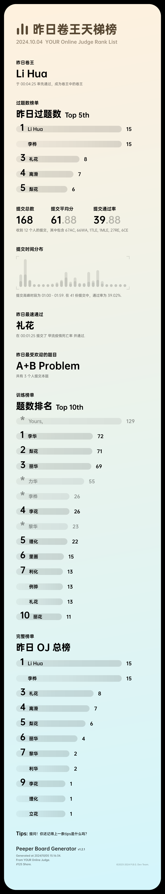
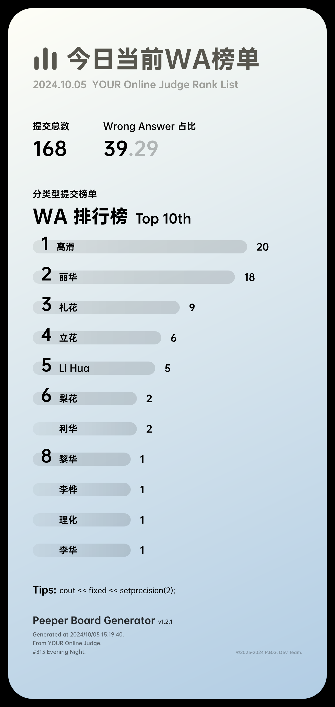

<h1 align="center">Peeper-Board-Generator</h1>
<div align="center">
  <strong>免费，开源的 OJ 榜单生成器</strong><br>
</div><br>

特点：

- **高度模块化**: 允许用户自定义模块（分为 OJ 爬取模块和榜单生成模块），方便用户开发更多的榜单主题和接入更多 OJ。
- **灵活**: 支持命令行调用程序直接生图 / QQ Bot 调用(coming soon)
- **内置大量单元测试**: 方便用户二次开发时对开发模块进行快速测试

欢迎接入更多的 OJ 以及编写更多的榜单样式，欢迎提交 issue 和 pr。

## 支持的 OJ
- [x] Hydro
- [ ] Codeforces
- [ ] Atcoder

## TODO
- [ ] 进一步完善 theme / misc 的文件结构
- [ ] 完善多 OJ 支持 和多 theme 支持
- [ ] 完善 QQ Bot 调用部分

## 使用方法
1. 安装依赖
```bash
pip install -r requirements.txt
```
2. 编写配置文件

请参照 `config_example.json` 编写配置文件，将其保存为 `configs.json`。

3. 运行程序
```bash
python main.py --help

usage: main.py [-h] (--full | --now) [--version] [--verdict VERDICT] [--output FILE]

Hydro Bot Args Parser

options:
  -h, --help         show this help message and exit
  --full             生成昨日榜单
  --now              生成从今日0点到当前时间的榜单
  --version          版本号信息
  --verdict VERDICT  指定榜单对应verdict (使用简写)
  --output OUTPUT    指定生成图片的路径 (包含文件名)
```

## 样例图片

Tip: 图片中 "YOUR Online Judge" 字样可在 `configs.json` 中的 `board_name` 字段更改。

### 昨日榜单 (`--full`)



### 从今日0点到当前时间的榜单 (`--now`)


### 从今日0点到当前时间的 Wrong Answer 榜单 (`--now --verdict WA`)



## 致谢

**Dev Team**: FJNU-[Floating-Ocean](https://github.com/Floating-Ocean)，QLU-[qwedc001](https://github.com/qwedc001)

**贡献者**: QLU-[Euphria](https://github.com/Euphria)
